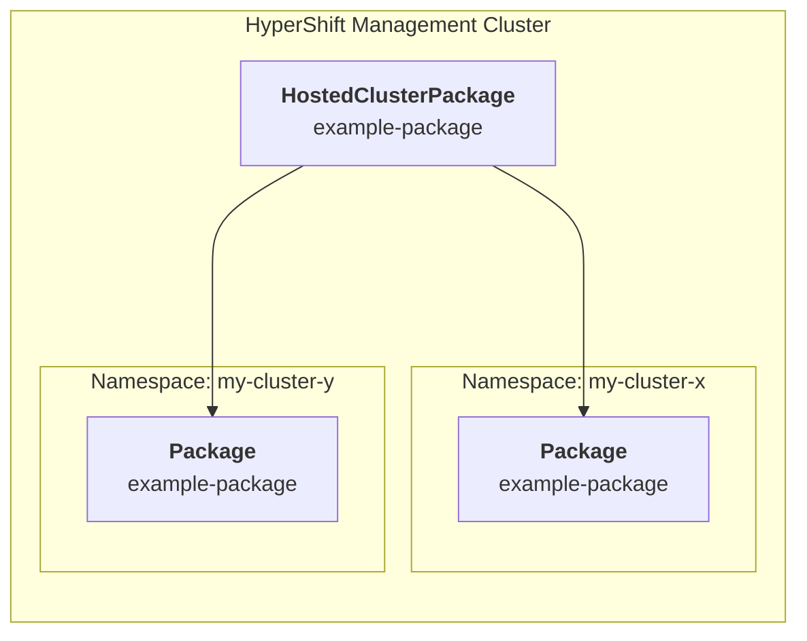

**Note**: The `HostedClusterPackage` API is experimental and subject to
change in the future.

The `HostedClusterPackage` API extends Package Operator with progressive
rollout capabilities for Packages targeting HyperShift Hosted Control Planes
(HCP). It introduces a cluster-scoped custom resource, the
`HostedClusterPackage`, which governs the lifecycle and update process of
Packages across all hosted control planes within a HyperShift Management
Cluster.

## Overview

This API allows for the central rollout of `Packages` to all hosted control
planes on a given management cluster. It provides facilities to control
rollout strategies, significantly reducing the "blast radius" of failed
upgrades compared to simultaneous updates. It also simplifies the
configuration required to deliver objects into an HCP namespace by reducing
the dependency on multiple systems down to a single API.



### Key Features

* **Progressive Rollout**: Updates are rolled out gradually to `HostedClusters`
  rather than all at once.
* **Lifecycle Automation**: Automatically creates Packages for new
  `HostedClusters` and deletes them when the cluster is removed.
* **Status & Monitoring**: Provides status updates on the number
  of available, unavailable, or updated packages.
* **Simplified Configuration**: Reduces the configuration surface from
  multiple objects to just the `HostedClusterPackage` API.

## HostedClusterPackage Resource

The newly introduced `HostedClusterPackage` resource configuration object
for this functionality. It coordinates the rollout process and which
`HostedClusters` in the fleet are targeted.

### Targeting Clusters

The list of `HostedCluster` objects can be limited by specifying an optional
label selector.

Example selecting `HostedCluster`s with the `foo: bar` label.

```yaml
spec:
  hostedClusterSelector:
    matchLabels:
      foo: bar
  template: {}
```

### Partitioning

To control the order of updates, you can attach an optional partition
configuration to the Package API. This ensures that all items within a
specific group are processed before the rollout moves to the next group.

* **Grouping**: The configuration uses labels on the HostedCluster object to
  assign groups (e.g., hypershift.openshift.io/risk-group).
* **Ordering**: Groups can be ordered via a static list or by alphanumeric
  ascending order.
* **Implicit Handling**: HostedClusters without the specified label or with
  unknown values are placed in an implicit "unknown" group and upgraded last.
* **Dynamic Regrouping**: If a cluster's label changes to an earlier group
  during an upgrade, the process will jump back to handle that group before
  continuing.

Example for `static` ordering:

```yaml
spec:
  partition:
    labelKey: hypershift.openshift.io/risk-group
    order:
      static:
        - early
        - normal
        - late
```

Example for `alphanumeric` ordering:

```yaml
spec:
  partition:
    labelKey: hypershift.openshift.io/risk-group
    order:
      alphanumericAsc: {}
```

### Progression Strategies

The API supports configurable progression strategies to control the speed
and safety of the rollout.

### Rolling Upgrade

The `rollingUpgrade` strategy is designed to keep service disruptions to a
minimum.

* `maxUnavailable`: Configures the maximum number of Package instances that
  can be updating or unavailable at the same time. If a Package is already
  unavailable before the upgrade starts, it counts towards this limit. These
  unavailable packages are prioritized for updates to prevent accumulating
  faulty versions.

```yaml
spec:
  strategy:
    rollingUpgrade:
      maxUnavailable: 1
```

## Status & Observability

The `HostedClusterPackage` API exposes status information to help you track the
progress of a rollout and the health of the fleet. This status can help you
understand if an update is proceeding smoothly or if it has stalled due to
errors.

### Rollout State

The status subresource provides high-level metrics regarding the rollout
process. These fields allow you to quickly assess the distribution of package
versions across your `HostedClusters`:

* **Updated Packages**: The number of `HostedClusters` that have successfully
  received the latest version of the Package.

* **Available Packages**: The number of `HostedClusters` where the Package is
  currently healthy and serving traffic based on `Available=True` status condition
  of the Package

* **Unavailable Packages**: The number of HostedClusters where the Package is
  currently degraded. This count is used to enforce the
  maxUnavailable limit defined in the progression strategy.

### Progression Logic

The controller uses the status of individual Packages to determine if the
rollout can proceed to the next target.

* **Success**: If a targeted HostedCluster successfully updates and becomes
  available, the operator proceeds to select the next cluster in the partition.

* **Failure**: If a Package update fails or becomes unavailable, the rollout
  pauses for that target hosted cluster. This prevents the propagation of errors
  to the rest of the fleet.

Example `Status` and `Conditions` for a successful rollout:

```yaml
status:
  availablePackages: 3
  conditions:
  - lastTransitionTime: "2026-02-05T06:59:51Z"
    message: 3/3 packages available.
    observedGeneration: 2
    reason: EnoughPackagesAvailable
    status: "True"
    type: Available
  - lastTransitionTime: "2026-02-05T06:59:57Z"
    message: 3/3 packages progressed.
    observedGeneration: 2
    reason: AllPackagesProgressed
    status: "False"
    type: Progressing
  - lastTransitionTime: "2026-02-05T06:57:57Z"
    message: 0/3 packages paused.
    observedGeneration: 2
    reason: NoPackagePaused
    status: "False"
    type: HasPausedPackage
  observedGeneration: 2
  progressedPackages: 3
  totalPackages: 3
  updatedPackages: 3
```

## Configuration Example

The following YAML example demonstrates a HostedClusterPackage configured with
risk-based partitioning and a rolling upgrade strategy.

```yaml
apiVersion: package-operator.run/v1alpha1
kind: HostedClusterPackage
metadata:
  name: example-hosted-cluster-package
spec:
  partition:
    labelKey: hypershift.openshift.io/risk-group
    order:
      alphanumericAsc: {}
  strategy:
    rollingUpgrade:
      maxUnavailable: 1 # Max packages to update concurrently
  template:
    metadata:
      labels:
        foo: bar
    spec:
      image: some-registry.io/foo-bar/test:v0.0.1
```
